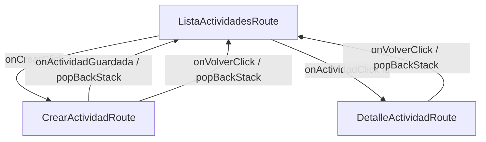
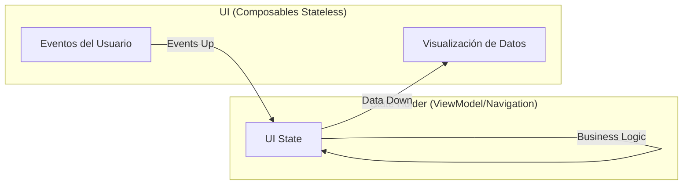

# Informe de Desarrollo: Mi Formación CTMA

## Actividad: Desarrollo de Aplicación Móvil con Jetpack Compose y Navegación Robusta
**Responsable Técnico:** Wilson Castro Gil  
**Coordinación de Proyecto:** Equipo de Desarrollo (4 integrantes)  
**Rama Principal de Trabajo:** `feat/thomas`  
**Scrum Master:** Thomas

---

## 1. Contexto del Proyecto
"Mi Formación CTMA" es una solución móvil diseñada bajo el paradigma de desarrollo moderno en Android. El objetivo principal es la gestión eficiente de compromisos formativos, permitiendo el seguimiento de progreso, priorización de tareas y visualización detallada de actividades técnicas en un entorno académico y profesional.

---

## 2. Arquitectura y Tecnologías
La aplicación sigue una **Arquitectura en Capas (Clean Architecture)** simplificada, promoviendo la inmutabilidad y la separación de responsabilidades:
*   **Lenguaje:** Kotlin 2.0.21
*   **UI Toolkit:** Jetpack Compose con Material Design 3
*   **Navegación:** Navigation Compose con Seguridad de Tipos (Type-safe)
*   **Serialización:** Kotlinx Serialization
*   **Gestión de Estado:** Unidirectional Data Flow (UDF) y State Hoisting

---

## 3. Procesos y Componentes Implementados

### A. Modelo de Dominio y Lógica Pura (`domain`)
*   **`ActividadFormativa`**: Modelo de datos inmutable que encapsula la identidad y estado de cada tarea.
*   **`ReglasActividad`**: Objeto centralizado de lógica de negocio. Realiza validaciones estrictas (título de 3 a 80 caracteres) y cálculos dinámicos de estado (Pendiente, En Progreso, Completada, Vencida) basándose en el progreso y plazos temporales.

### B. Navegación Segura y Gestión de Pila (`AppNavigation`)
*   **Rutas Serializables**: Implementación de `ListaActividadesRoute`, `CrearActividadRoute` y `DetalleActividadRoute(actividadId: Long)` utilizando tipos fuertemente tipados, eliminando errores por cadenas de texto mal escritas.
*   **State Hoisting**: El estado de la lista global se eleva a este componente, permitiendo que todas las pantallas reflejen cambios en tiempo real de forma sincronizada.

### C. Interfaz Adaptativa y Reutilizable (`ui.screens` & `ui.components`)
*   **`PantallaActividades`**: Implementa `BoxWithConstraints` para detectar el ancho del dispositivo, alternando automáticamente entre un listado vertical (`LazyColumn`) y una cuadrícula (`LazyVerticalGrid`) para tablets o modo horizontal.
*   **`TarjetaActividad`**: Componente visual atómico que utiliza `LinearProgressIndicator` y chips informativos para resumir la información de un vistazo.

### D. Gestión de Detalle y Resiliencia (`PantallaDetalle`)
*   **`DetalleUiState`**: Implementación de una interfaz sellada (Sealed Interface) para gestionar tres estados posibles: `Cargando`, `Exito` y `NoEncontrada`. Esto garantiza que la aplicación no se cierre ante IDs de actividad inexistentes, proporcionando una respuesta visual controlada.

### E. Formularios Interactivos y Captura de Datos (`PantallaCrearActividad`)
*   **Selector de Fecha (DatePicker)**: Integración de un diálogo de calendario interactivo para la selección de plazos (día, mes, año).
*   **Control de Progreso (Slider)**: Uso de deslizadores para asignar el porcentaje inicial de avance de forma táctil y visual.
*   **Formulario Controlado**: Implementación de validación en tiempo real con mensajes de error dinámicos y protección contra "doble toque" en el botón de guardado.

---

## 4. Flujo de Trabajo (Git Workflow)
El desarrollo se ha orquestado bajo la metodología Scrum, liderado por **Thomas (Scrum Master)**. Todo el código y los incrementos de funcionalidad se han consolidado en la rama de característica `feat/thomas`, asegurando la trazabilidad de los cambios y la estabilidad del código base antes de su integración final.

---

## 5. Casos de Prueba y Validación
Se han verificado satisfactoriamente los siguientes escenarios:
*   **Persistencia de Borradores**: Uso de `rememberSaveable` para mantener el texto del formulario tras rotaciones de pantalla.
*   **Cálculo de Días**: Verificación de la diferencia de días entre la fecha seleccionada y la fecha actual del sistema.
*   **Back Stack**: Navegación fluida de regreso (`popBackStack`) tras completar acciones, evitando duplicidad en la historia de la aplicación.

---

## 6. Diagramas Técnicos

### Mapa de Navegación

### Flujo Unidireccional de Datos (UDF)

---

## 7. Matriz de Continuidad (Semana 3 -> Semana 4)
| Componente | Semana 3 | Evolución Semana 4 |
| --- | --- | --- |
| **Navegación** | Pantalla Única | NavHost con 3 destinos y Type-safety |
| **Estado** | Datos Ficticios Estáticos | Lista Observable con State Hoisting |
| **Formulario** | No existía | Formulario controlado con validación y borrador |
| **Detalle** | Click sin acción | Pantalla dedicada con manejo de ID y errores |
| **Restauración** | N/A | rememberSaveable para formularios |
| **Validación** | Básica | Reglas puras para Título, Descripción y Fecha |

---

## 9. Mapeo de Componentes (Material de Estudio - Semana 4)

| Componente | Uso en Proyecto | Descripción Técnica |
| --- | --- | --- |
| **rememberSaveable** | Formulario y Lista | Conserva el estado ante recreación de la Activity. |
| **State Hoisting** | PantallaCrearActividad | Eleva el estado al contenedor, dejando el formulario stateless. |
| **UDF** | Todo el flujo | Datos bajan (State), Eventos suben (Callbacks). |
| **LaunchedEffect** | Tracking de Pantallas | Dispara efectos laterales únicos al entrar en la composición. |
| **DisposableEffect** | Ciclo de Vida | Gestiona la limpieza de observadores y recursos. |
| **Safe Navigation** | NavHost | Navegación con tipos serializables y paso de ID único. |
| **Reglas Puras** | ReglasActividad | Lógica de validación independiente de la interfaz. |
