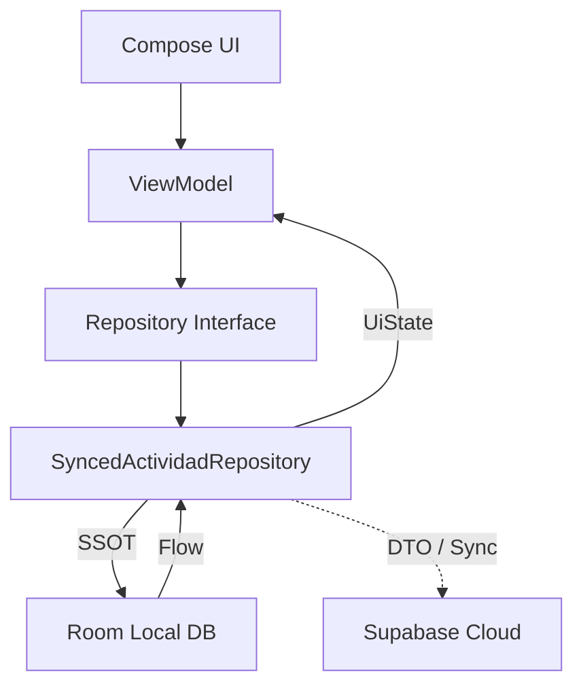

## Informe de Desarrollo: Mi Formación CTMA

## Actividad: Desarrollo de Aplicación Móvil con Resiliencia y Servicios Cloud
**Responsable Técnico:** Wilson Castro Gil  
**Coordinación de Proyecto:** Equipo de Desarrollo (4 integrantes)  
**Rama Principal de Trabajo:** `feature/semana-08-cloud-resilience`  
**Scrum Master:** Thomas

---

## 1. Contexto del Proyecto (Semana 8)
En esta fase, "Mi Formación CTMA" alcanza su madurez en la gestión de datos mediante la integración de **servicios en la nube (Supabase)** y la implementación de patrones de **resiliencia**. El enfoque central es la separación de responsabilidades entre el transporte de red y la lógica de negocio, asegurando que la aplicación sea 100% funcional incluso sin conectividad.

---

## 2. Arquitectura de Datos y Resiliencia (Semana 8)
Se ha implementado una arquitectura **Offline-First** profesional:
*   **DTO (Data Transfer Objects):** Creación de `ActividadDto.kt` para desacoplar el contrato de la API (Supabase) del modelo de dominio.
*   **Repositorio Híbrido:** El `SyncedActividadRepository` actúa como orquestador, priorizando **Room** como Fuente Única de Verdad (SSOT) y sincronizando con la nube de forma asíncrona.
*   **Manejo de Fallos:** Implementación de bloques try-catch resilientes que permiten que la app continúe operando localmente si el servidor remoto no responde o devuelve errores.

---

## 3. Calidad y Automatización (QA)
Siguiendo los lineamientos de ADSO para la Semana 8:
*   **Patrón AAA (Arrange-Act-Assert):** Todas las pruebas unitarias han sido refactorizadas bajo este estándar industrial para máxima claridad.
*   **Prueba de Resiliencia:** Inclusión de `ResilienciaRepositoryTest.kt`, que valida determinísticamente que los datos se conservan en la base local tras un fallo simulado de la API.
*   **GitHub Actions:** CI actualizado para ejecutar la suite completa de **22 tests** con JDK 25.

---

## 4. Diagrama de Arquitectura Híbrida

---

## 3. Implementaciones Detalladas (Semana 7)

### A. Gestión de Estado UI (UiState)
*   **Modelado de Estados**: Implementación de `sealed interface` para `ListadoUiState` (Cargando, Vacio, Contenido, Error) y `OperacionUiState` (Inactiva, EnCurso, Exitosa, Fallida).
*   **Exposición Segura**: Uso de `stateIn` con la política `SharingStarted.WhileSubscribed(5_000)` para optimizar el uso de recursos y mantener el estado durante cambios de configuración (rotación).

### B. Concurrencia Estructurada
*   **ViewModelScope**: Todo el trabajo asíncrono de UI se liga al ciclo de vida del ViewModel, garantizando la cancelación automática al cerrar la pantalla.
*   **Búsqueda Cancelable**: Uso del operador `flatMapLatest` en la barra de búsqueda para cancelar automáticamente consultas obsoletas cuando el usuario escribe rápidamente, priorizando siempre la entrada más reciente.
*   **Main-Safety**: Las operaciones de escritura (guardar/eliminar) se ejecutan de forma segura sin bloquear la interfaz, comunicando progreso y errores mediante `OperacionUiState`.

### C. Integración Compose y Lifecycle
*   **Recolección Consciente**: Migración de `collectAsState` a **`collectAsStateWithLifecycle`**, asegurando que la aplicación deje de consumir datos cuando la interfaz no es visible para el usuario.

---

## 4. Validación de Casos de Aceptación (CA)

| Caso | Escenario | Resultado |
| :--- | :--- | :--- |
| **CA-01** | Abrir sin actividades | Visualización correcta de `ListadoUiState.Vacio`. |
| **CA-02** | Insertar actividad | Actualización reactiva instantánea vía Flow de Room. |
| **CA-03** | Reiniciar con filtros | Restauración exitosa desde DataStore mediante `combine`. |
| **CA-04** | Búsquedas rápidas | Cancelación de Jobs previos mediante `flatMapLatest`. |
| **CA-05** | Fallo de repositorio | Captura de excepción y muestra de `ListadoUiState.Error`. |
| **CA-06** | Salir durante operación | Cancelación automática de la corrutina en `onCleared`. |
| **CA-07** | Rotación de pantalla | Persistencia del estado gracias a `StateFlow` y `stateIn`. |
| **CA-08** | Suite de pruebas | 14 tests deterministas ejecutados con `runTest`. |

---

## 5. Aseguramiento de Calidad (QA)
*   **Pruebas Unitarias**: Suite completa en `ActividadesViewModelTest.kt` validando transiciones de estado y lógica de filtrado/ordenamiento.
*   **Tiempo Virtual**: Uso exclusivo de `StandardTestDispatcher` y `runTest`, cumpliendo con la prohibición institucional de usar `Thread.sleep`.
*   **Higiene**: 0 Errores, 0 Warnings críticos.

---

## 6. Reflexión Técnica
La implementación de flujos reactivos y concurrencia estructurada ha transformado la aplicación en un sistema resiliente. El mayor desafío fue la coordinación de múltiples fuentes de datos (Room y DataStore); el uso del operador `combine` permitió unificar estas fuentes en un único `UiState` coherente, eliminando "estados imposibles" donde la UI mostraba información contradictoria. La migración a `collectAsStateWithLifecycle` garantiza que la app sea responsable con los recursos del sistema (batería/RAM), un estándar indispensable para el desarrollo profesional en 2026.
