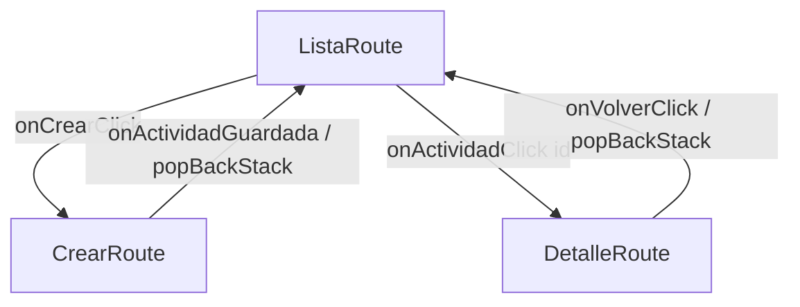
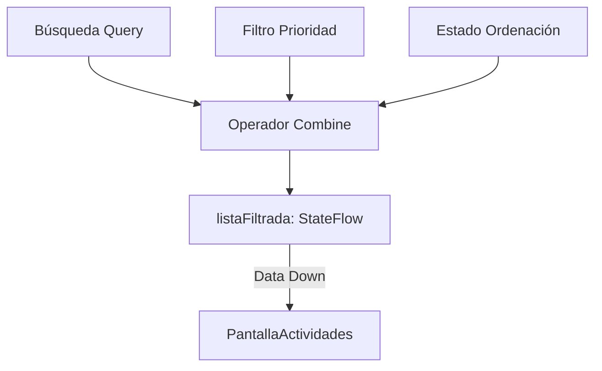

# Informe de Desarrollo: Mi Formación CTMA

## Actividad: Desarrollo de Aplicación Móvil con Jetpack Compose y Navegación Robusta
**Responsable Técnico:** Wilson Castro Gil  
**Coordinación de Proyecto:** Equipo de Desarrollo (4 integrantes)  
**Rama Principal de Trabajo:** `feat/thomas`  
**Scrum Master:** Thomas

---

## 1. Contexto del Proyecto
"Mi Formación CTMA" es una solución móvil diseñada bajo el paradigma de desarrollo moderno en Android. El objetivo principal es la gestión eficiente de compromisos formativos, permitiendo el seguimiento de progreso, priorización de tareas y visualización detallada de actividades técnicas en un entorno académico y profesional.

---

## 2. Arquitectura y Tecnologías
La aplicación sigue una **Arquitectura en Capas (Clean Architecture)** simplificada, promoviendo la inmutabilidad y la separación de responsabilidades:
*   **Lenguaje:** Kotlin 2.0.21
*   **UI Toolkit:** Jetpack Compose con Material Design 3
*   **Navegación:** Navigation Compose con Seguridad de Tipos (Type-safe)
*   **Serialización:** Kotlinx Serialization
*   **Gestión de Estado:** Unidirectional Data Flow (UDF), State Hoisting y **ViewModel (StateFlow)**.
*   **Reactividad:** Uso de operadores `combine` y `update` para procesamiento de datos en tiempo real.

---

## 3. Procesos y Componentes Implementados

### A. Modelo de Dominio y Lógica Pura (`domain`)
*   **`ActividadFormativa`**: Modelo de datos inmutable que encapsula la identidad y estado de cada tarea.
*   **`ReglasActividad`**: Objeto centralizado de lógica de negocio. Realiza validaciones estrictas (título de 3 a 80 caracteres) y cálculos dinámicos de estado (Pendiente, En Progreso, Completada, Vencida).

### B. Navegación Segura y Gestión de Pila (`AppNavigation`)
*   **Rutas Serializables**: Implementación de `ListaRoute`, `CrearRoute` y `DetalleRoute(actividadId: String)` utilizando tipos fuertemente tipados.
*   **Integración con ViewModel**: La navegación consume el estado global de forma reactiva, asegurando que los datos se mantengan sincronizados al navegar entre pantallas.

### C. Interfaz Adaptativa y Reutilizable (`ui.screens` & `ui.components`)
*   **`PantallaActividades`**: Implementa `BoxWithConstraints` para alternar entre `LazyColumn` y `LazyVerticalGrid` según el ancho del dispositivo.
*   **`TarjetaActividad`**: Ahora mejorada con **PrioridadChips** (HU 06) que utilizan colores semánticos (Rojo, Naranja, Azul) para una priorización visual inmediata.

### D. Gestión de Detalle y Resiliencia (`PantallaDetalle`)
*   **`DetalleUiState`**: Interfaz sellada para gestionar estados de `Cargando`, `Exito` y `NoEncontrada`, garantizando una experiencia de usuario robusta ante errores de ID.

### E. Formularios Interactivos y Captura de Datos (`PantallaCrearActividad`)
*   **Validación en Tiempo Real**: Implementación de `FormularioActividadUiState` para mostrar errores solo tras el primer intento de guardado.
*   **Control de Progreso y Fecha**: Integración de `Slider` y `DatePicker` interactivos.

---

## 4. Nuevas Funcionalidades - Semana 4 (Historias de Usuario)
El día de hoy se han integrado las siguientes mejoras críticas al núcleo del proyecto:

*   **HU 05: Búsqueda en Tiempo Real**: Barra de búsqueda reactiva que filtra la lista por título instantáneamente mientras el usuario escribe.
*   **HU 06: Visualización de Prioridad con Chips**: Integración de `AssistChip` con colores semánticos en las tarjetas para identificar urgencias de un vistazo.
*   **HU 07: Filtrado por Nivel de Prioridad**: Fila de `FilterChip` interactivos para segmentar la lista por categorías (Alta, Media, Baja).
*   **HU 08: Ordenación por Vencimiento**: Botón de acción en la `TopBar` que organiza las actividades priorizando las fechas de entrega más próximas.

---

## 5. Flujo de Trabajo (Git Workflow)
El desarrollo se ha orquestado bajo la metodología Scrum, liderado por **Thomas (Scrum Master)**. Todo el código y los incrementos de funcionalidad se han consolidado en la rama de característica `feat/thomas`.

---

## 6. Casos de Prueba y Validación
Se han verificado satisfactoriamente los siguientes escenarios:
*   **Filtros Combinados**: Funcionamiento simultáneo de búsqueda por texto y filtros de prioridad.
*   **Persistencia de Borradores**: Uso de `rememberSaveable` en el formulario.
*   **Protección de Doble Toque**: Bloqueo del botón guardar para evitar registros duplicados.
*   **Carga de Datos Completa**: Restauración de las 10 actividades formativas originales en `MockData`.

---

## 7. Diagramas Técnicos

### Mapa de Navegación

### Flujo de Estado con ViewModel (HU 05-08)

---

## 8. Matriz de Continuidad y Evolución del Proyecto
Esta tabla recalca la evolución desde la base hasta las funcionalidades avanzadas actuales:

| Componente | Semana 3 | Semana 4 (Base) | Semana 4 (HU 05-08) |
| --- | --- | --- | --- |
| **Navegación** | Pantalla Única | NavHost con Type-safety | Navegación sincronizada con ViewModel |
| **Estado** | Datos Estáticos | Lista Observable | **Filtrado y Ordenación Reactiva** |
| **Formulario** | No existía | Validación básica | Validación en tiempo real y UI State |
| **Búsqueda** | N/A | N/A | **Búsqueda instantánea en TopBar** |
| **Priorización** | Texto plano | Chips simples | **Chips con Colores Semánticos** |
| **Ordenación** | N/A | N/A | **Orden inteligente por vencimiento** |

---

## 9. Mapeo de Componentes (Material de Estudio)

| Componente | Uso en Proyecto | Descripción Técnica |
| --- | --- | --- |
| **ViewModel** | ActividadesViewModel | Centraliza la lógica y sobrevive a cambios de configuración. |
| **StateFlow** | uiState | Expone un flujo de estado reactivo a la UI. |
| **combine** | Filtrado de Lista | Combina múltiples estados en una vista filtrada única. |
| **rememberSaveable** | Formularios | Conserva el estado ante recreación de la Activity. |
| **UDF** | Todo el flujo | Datos bajan (State), Eventos suben (Callbacks). |
| **Safe Navigation** | NavHost | Navegación con tipos serializables y seguridad de tipos. |
| **Assist/Filter Chips** | Prioridades y Filtros | Componentes M3 para interacción y contexto visual rápido. |
