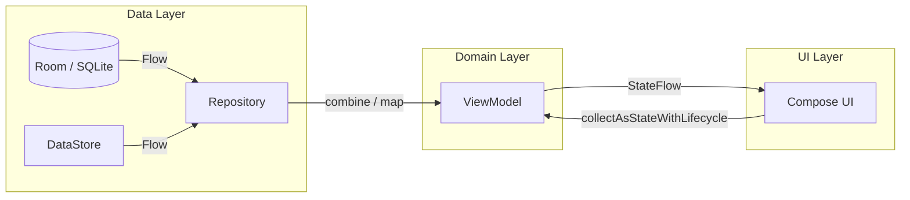

# Informe de Desarrollo: Mi Formación CTMA

## Actividad: Desarrollo de Aplicación Móvil con Concurrencia y Estado Reactivo
**Responsable Técnico:** Wilson Castro Gil  
**Coordinación de Proyecto:** Equipo de Desarrollo (4 integrantes)  
**Rama Principal de Trabajo:** `feature/semana-07-coroutines-flow`  
**Scrum Master:** Thomas

---

## 1. Contexto del Proyecto
"Mi Formación CTMA" evoluciona hacia una arquitectura totalmente asíncrona y reactiva. En esta fase, se integra la gestión de corrutinas de Kotlin y flujos reactivos (Flow/StateFlow) para manejar la persistencia de datos y el estado de la interfaz de usuario de manera eficiente, respetando el ciclo de vida de Android y evitando bloqueos en el hilo principal.

---

## 2. Arquitectura y Tecnologías (Semana 7 - MAD Stack)
La aplicación consolida su **Arquitectura de Capas** con un enfoque reactivo:
*   **Lenguaje:** Kotlin 2.4.10 (Compilador K2).
*   **Concurrencia:** **Kotlin Coroutines** para operaciones asíncronas no bloqueantes.
*   **Flujos Reactivos:** **Flow** y **StateFlow** para el transporte y exposición de estados.
*   **Ciclo de Vida:** **Lifecycle Runtime Compose** para una recolección de flujos segura.
*   **UI Toolkit:** Jetpack Compose con Material Design 3.
*   **Persistencia:** Room 3.0.2 y Preferences DataStore 1.2.1.

---

## 3. Implementaciones Detalladas (Semana 7)

### A. Gestión de Estado UI (UiState)
*   **Modelado de Estados**: Implementación de `sealed interface` para `ListadoUiState` (Cargando, Vacio, Contenido, Error) y `OperacionUiState` (Inactiva, EnCurso, Exitosa, Fallida).
*   **Exposición Segura**: Uso de `stateIn` con la política `SharingStarted.WhileSubscribed(5_000)` para optimizar el uso de recursos y mantener el estado durante cambios de configuración (rotación).

### B. Concurrencia Estructurada
*   **ViewModelScope**: Todo el trabajo asíncrono de UI se liga al ciclo de vida del ViewModel, garantizando la cancelación automática al cerrar la pantalla.
*   **Búsqueda Cancelable**: Uso del operador `flatMapLatest` en la barra de búsqueda para cancelar automáticamente consultas obsoletas cuando el usuario escribe rápidamente, priorizando siempre la entrada más reciente.
*   **Main-Safety**: Las operaciones de escritura (guardar/eliminar) se ejecutan de forma segura sin bloquear la interfaz, comunicando progreso y errores mediante `OperacionUiState`.

### C. Integración Compose y Lifecycle
*   **Recolección Consciente**: Migración de `collectAsState` a **`collectAsStateWithLifecycle`**, asegurando que la aplicación deje de consumir datos cuando la interfaz no es visible para el usuario (ahorro de batería y memoria).
*   **Interfaz Accesible**: Representación visual clara de estados de carga (ProgressBar), errores con opción de reintento y estados vacíos informativos.

---

## 4. Aseguramiento de Calidad (QA)
Infraestructura de pruebas actualizada para entornos asíncronos:
*   **Pruebas Deterministas**: Suite de 14 tests unitarios ejecutados con `runTest` y `StandardTestDispatcher`, eliminando el uso de `Thread.sleep` y garantizando resultados rápidos y confiables.
*   **Validación de Transiciones**: Verificación de flujos desde `Cargando` hasta `Contenido` o `Error`.
*   **Simulación de Fallos**: Pruebas de captura de excepciones en el repositorio y visualización de mensajes de error en la UI.

---

## 5. Diagrama de Flujo Reactivo

---

## 6. Decisiones Técnicas Destacadas

| Decisión | Justificación |
| --- | --- |
| **flatMapLatest** | Evita condiciones de carrera en búsquedas y asegura que solo el último término buscado sea procesado. |
| **WhileSubscribed(5s)** | Mantiene el flujo activo durante rotaciones de pantalla rápidas pero lo detiene si el usuario sale de la app. |
| **CancellationException** | Se relanza obligatoriamente en bloques try-catch para respetar la cancelación cooperativa de corrutinas. |
| **Repository SSOT** | El repositorio combina Room y DataStore para entregar un único flujo de dominio filtrado y ordenado. |
