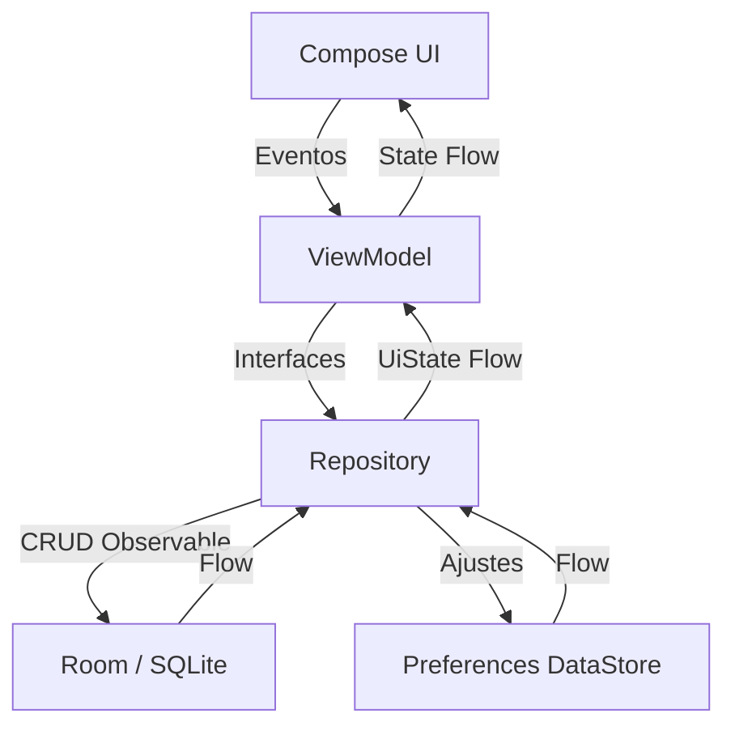
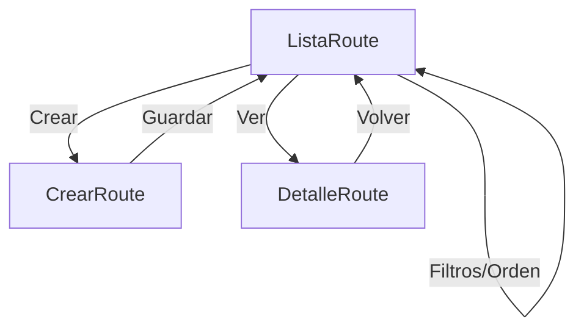

# Informe de Desarrollo: Mi Formación CTMA

## Actividad: Desarrollo de Aplicación Móvil con Jetpack Compose y Persistencia Local
**Responsable Técnico:** Wilson Castro Gil  
**Coordinación de Proyecto:** Equipo de Desarrollo (4 integrantes)  
**Rama Principal de Trabajo:** `feat/persistencia-room`  
**Scrum Master:** Thomas

---

## 1. Contexto del Proyecto
"Mi Formación CTMA" es una solución móvil profesional diseñada bajo el paradigma de desarrollo moderno en Android. Su propósito es la gestión eficiente de compromisos formativos, permitiendo el seguimiento de progreso, priorización mediante lógica de colores y persistencia de datos a largo plazo en un entorno académico y profesional.

---

## 2. Arquitectura y Tecnologías (MAD Stack)
La aplicación sigue una **Arquitectura de Capas (Clean Architecture)** orientada a la mantenibilidad y escalabilidad:
*   **Lenguaje:** Kotlin 2.0.21 (Compilador K2).
*   **UI Toolkit:** Jetpack Compose con Material Design 3.
*   **Gestión de Estado:** ViewModel con StateFlow y flujos reactivos (`Flow`).
*   **Navegación:** Navigation Compose con Seguridad de Tipos (Type-safe).
*   **Persistencia Local:** **Room 3.0.2** (SQLite) como fuente única de verdad.
*   **Preferencias:** **Preferences DataStore 1.2.1** para ajustes del usuario.
*   **Procesamiento:** Operadores reactivos avanzados (`combine`, `asSequence`).

---

## 3. Implementaciones Detalladas (Semana 6)

### A. Capa de Datos y Fuente Única de Verdad
*   **Room Database**: Implementación de `FormacionDatabase` con soporte para relaciones 1:N entre Competencias y Actividades.
*   **Evolución del Esquema**: Gestión de migración segura (Versión 1 ➔ 2) incorporando el estado de completitud sin pérdida de información.
*   **Repositorios Desacoplados**: Uso de interfaces en la capa de dominio (`ActividadRepository`) implementadas en la capa de datos (`RoomActividadRepository`), aislando la UI de los detalles de almacenamiento.

### B. Funcionalidades de Usuario (HU 05 - HU 08)
*   **HU 05 - Búsqueda Reactiva**: Filtrado instantáneo por título en la barra superior.
*   **HU 06 - Priorización Visual**: Tarjetas con chips de colores semánticos (Rojo/Naranja/Azul) según la urgencia.
*   **HU 07 - Filtrado Persistente**: Segmentación por prioridad que se mantiene tras cerrar la aplicación (DataStore).
*   **HU 08 - Ordenación Inteligente**: Reordenamiento dinámico por fecha de vencimiento.

### C. Interfaz y Experiencia (UX/UI)
*   **Layout Adaptable**: Detección de ancho de pantalla para alternar entre lista y cuadrícula.
*   **Validación de Negocio**: Formulario controlado con reglas puras para fechas, títulos y descripciones.

---

## 4. Aseguramiento de Calidad (QA)
Se ha implementado una infraestructura de pruebas de nivel industrial:
*   **Tests Unitarios (ViewModel)**: 13 casos de prueba que validan el 100% de la lógica de filtrado y ordenación.
*   **Tests de Integración (Room)**: Validación del DAO y procesos de migración de base de datos.
*   **Estado Final**: **100% de éxito** en la ejecución de la suite de pruebas automatizadas.
*   **Higiene**: Código libre de advertencias y optimizado para rendimiento de memoria.

---

## 5. Diagramas Técnicos

### Arquitectura de Persistencia y Flujo de Datos

### Ciclo de Navegación

---

## 6. Mapeo de Componentes Técnicos

| Componente | Implementación | Propósito Técnico |
| --- | --- | --- |
| **Room 3** | `ActividadDao` | Persistencia estructurada y consultas observables. |
| **DataStore** | `PreferenciasRepository` | Persistencia de estado de UI y filtros. |
| **ViewModel** | `ActividadesViewModel` | Orquestación de flujos de múltiples repositorios. |
| **UDF** | Todo el flujo | Asegura una única vía de actualización de estado. |
| **Type-safe Nav** | `AppNavigation` | Navegación robusta basada en objetos serializables. |
